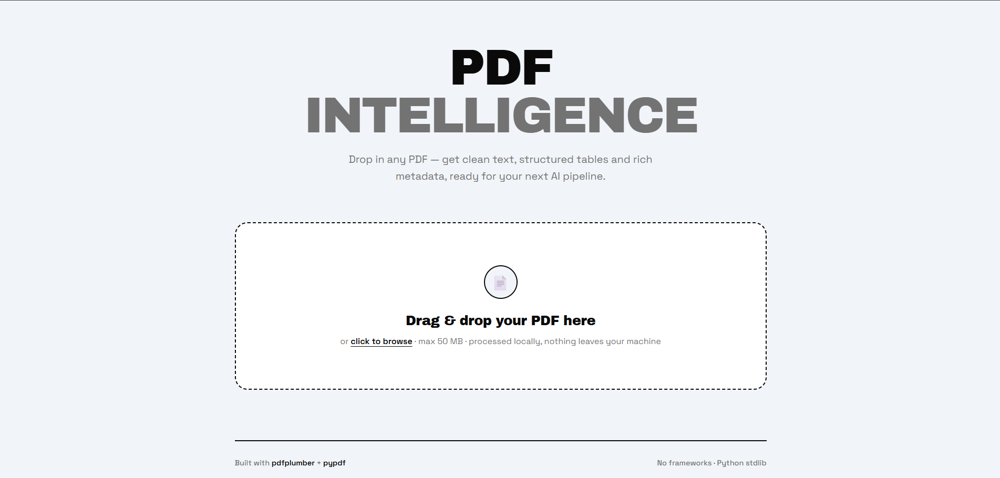
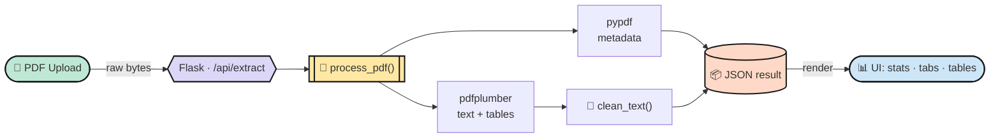
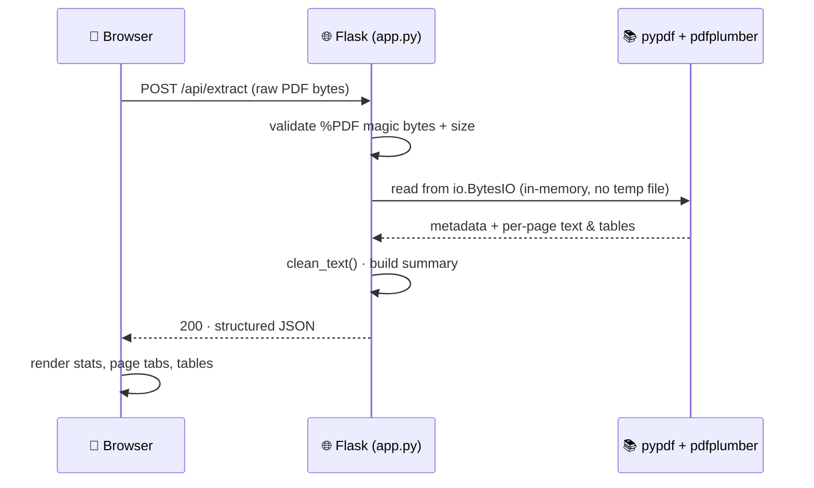
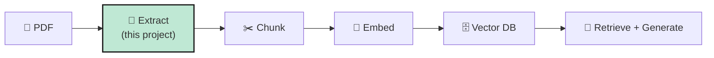

<!--
  ┌─────────────────────────────────────────────────────────────┐
  │  BEFORE PUSHING, replace these 3 placeholders everywhere:     │
  │    1. YOUR_LIVE_DEMO_URL   → your deployed app link           │
  │    2. YOUR_USERNAME        → your GitHub username             │
  │    3. (repo is assumed to be "unprof")                        │
  └─────────────────────────────────────────────────────────────┘
-->

<div align="center">

# 📄 PDF Intelligence

### Turn any PDF into clean, structured data — text, tables & metadata as JSON.

<em>Phase 2 · NLP &amp; Text AI · Day 12 — the document-ingestion step behind resume parsers, invoice readers &amp; RAG pipelines.</em>

<br/>

[](YOUR_LIVE_DEMO_URL)
&nbsp;
[](https://python.org)

<br/>


</div>

---

## ✨ Overview

**PDF Intelligence** is a single-file **Flask** web app that reads a multi-page PDF and
extracts everything useful from it:

- 📝 **Text** from every page — cleaned of PDF artifacts (broken hyphens, stray line breaks)
- 📊 **Tables** — reconstructed as real rows &amp; columns
- 🏷️ **Metadata** — title, author, page count
- 💾 **JSON** — one structured file, ready for the next stage of an AI pipeline

Drag a PDF into the browser and get animated stats, per-page tabs, and a one-click JSON download.

<div align="center">

<!-- 📸 Add a screenshot: drop a PNG next to this file and rename below -->


<sub><em>Flat pastel UI · strong typography · zero frameworks on the frontend.</em></sub>

</div>

---

## 🎯 Features

| | Feature | Detail |
|---|---|---|
| 📄 | **Multi-page reading** | Iterates every page, no page-count limit |
| 📝 | **Smart text cleaning** | De-hyphenates wrapped words, strips control chars, collapses whitespace |
| 📊 | **Table extraction** | Layout-aware detection via `pdfplumber` |
| 🏷️ | **Metadata** | Title, author, creator, total pages via `pypdf` |
| 🖱️ | **Drag &amp; drop UI** | Upload by drop or click — processed in-memory, nothing hits disk |
| 📈 | **Animated stats** | Live count-up of pages / words / tables / processing time |
| 💾 | **JSON export** | Download button + raw-JSON viewer |
| 🛡️ | **Input validation** | Checks `%PDF` magic bytes &amp; 50 MB size cap before parsing |

---

## 🧰 Tech Stack

| Layer | Tool | Why |
|-------|------|-----|
| **Web server** | `Flask` | Serves the UI + `/api/extract` JSON endpoint |
| **Metadata** | `pypdf` | Fast, lightweight — title / author / page count |
| **Text &amp; tables** | `pdfplumber` | Best pure-Python option for layout-aware tables |
| **Frontend** | Vanilla HTML/CSS/JS | No build step, no framework — one file |
| **Test data** | `reportlab` | Generates the sample PDF |

---

## 🏗️ How It Works



### Request lifecycle



---

## 📁 Project Structure

```
day12_pdf_extractor/
├── app.py                 ⭐ single file: extraction logic + Flask server
├── templates/
│   └── index.html         🎨 the UI (flat pastel, strong typography)
├── make_sample_pdf.py     🧪 generates a 3-page sample PDF for testing
├── sample_data/
│   └── sample_report.pdf
├── requirements.txt
└── README.md
```

---

## 🚀 Quick Start

```bash
# 1. Clone
git clone https://github.com/YOUR_USERNAME/unprof.git
cd unprof/day12_pdf_extractor

# 2. Install dependencies
pip install -r requirements.txt

# 3. (Optional) generate a sample PDF to test with
python make_sample_pdf.py

# 4. Run the app
python app.py
```

Then open 👉 **http://127.0.0.1:5000** and drop in a PDF.

> 🌍 **Live demo:** [YOUR_LIVE_DEMO_URL](YOUR_LIVE_DEMO_URL)

---

## 🔌 API Reference

| Method | Route | Body | Returns |
|--------|-------|------|---------|
| `GET`  | `/` | — | The web UI (HTML) |
| `POST` | `/api/extract` | Raw PDF bytes (`Content-Type: application/pdf`) | Extraction JSON |

**Example — cURL:**

```bash
curl -X POST http://127.0.0.1:5000/api/extract \
     -H "Content-Type: application/pdf" \
     -H "X-Filename: report.pdf" \
     --data-binary @sample_data/sample_report.pdf
```

**Response shape:**

```json
{
  "metadata": {
    "file_name": "report.pdf",
    "total_pages": 3,
    "title": "Quarterly Report",
    "author": "...",
    "creator": "..."
  },
  "pages": [
    {
      "page_number": 1,
      "text": "cleaned text of the page...",
      "word_count": 51,
      "table_count": 1,
      "tables": [
        [ ["Region", "Q1", "Q2"], ["North America", "1,240", "1,510"] ]
      ]
    }
  ],
  "summary": { "total_pages": 3, "total_words": 119, "total_tables": 2 }
}
```

---

## 🧹 Text Cleaning — why it's needed

PDFs store *where glyphs are painted*, not sentences — so raw extraction is messy.
`clean_text()` fixes four common artifacts:

| # | Problem | Example | Fix |
|---|---------|---------|-----|
| 1 | Hyphenated wrap | `docu-⏎ment` | `document` |
| 2 | Hard line breaks | `line1⏎line2` | `line1 line2` |
| 3 | Control chars | `\x0c`, `\x07` | removed |
| 4 | Repeated spaces | `a·····b` | `a b` |

---

## 🗺️ Roadmap

- [x] Multi-page text extraction
- [x] Table extraction
- [x] Text cleaning
- [x] JSON export
- [x] Flask web UI
- [x] Live deployment
- [ ] OCR for scanned PDFs (`pytesseract`)
- [ ] Batch upload (multiple PDFs)
- [ ] Chunk + embed → vector DB (RAG stage 2)

---

## 🧠 Why This Matters for AI

> Every **RAG (Retrieval-Augmented Generation)** pipeline starts with **document ingestion** —
> you can't embed or retrieve what you can't extract.

This project is **stage one** of an AI document assistant. The `pages[].text` field it
produces is exactly what gets **chunked → embedded → stored in a vector database** in the
next phase of the internship. 🚀



---

<div align="center">

### 🛠️ Built during Phase 2 · Day 12 of my Python &amp; AI internship

**Libraries:** `flask` · `pdfplumber` · `pypdf`

⭐ Star this repo if it helped you!

<br/>


</div>
